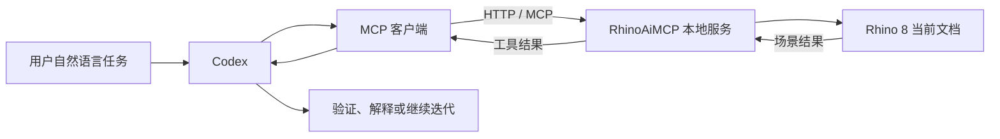

# Codex 接入 Rhino / RhinoAiMCP 学习资料

整理日期：2026-08-18  
适用对象：希望用 Codex 通过自然语言驱动 Rhino 建模、查询场景和执行 Rhino C# 脚本的用户。

## 0. 先说结论

用户提供的视频实际演示的是 **RhinoAiMCP + Claude Desktop**，不是 Codex 专场；但底层通信使用的是 MCP，因此可以迁移到 Codex。

推荐的 Codex 方案是：

1. 在 Windows 的 Rhino 8 中安装 RhinoAiMCP。
2. 在 Rhino 中执行 `RhinoAiMCP`，让插件启动本地 MCP 服务。
3. 确认服务地址为 `http://localhost:3001/mcp`。
4. 在 Codex 的 `config.toml` 中配置一个 Streamable HTTP MCP server。
5. 用 `codex mcp list` 或 Codex TUI 的 `/mcp` 检查连接。
6. 先用只读的 `get_scene` 验证，再允许 `rhinoceros_operator` 修改模型。

关键区别：Claude 使用 JSON 配置文件和 `mcp-remote` 转接；Codex 官方支持 Streamable HTTP，可以直接填 `url`，不必照抄 Claude 的 JSON 配置。

### 本机实际部署状态（2026-08-18）

本机最终采用的是 **Rhino 7 + `reer-ide/rhino_mcp` 本地 STDIO MCP 桥接**，不是视频中 RhinoAiMCP 的 `http://localhost:3001/mcp` 插件路线。原因是当前电脑提供的是 Rhino 7，且 RhinoAiMCP 对 Rhino 7 的兼容性不稳定。

- Rhino 7：`D:\Program Files\Rhino 7\System\Rhino.exe`
- Rhino 侧脚本：`D:\20260525\2026项目汇总\AIGC\CODEX\tools\rhino_mcp\rhino_script.py`
- 本地端口：`127.0.0.1:9876`
- Codex MCP 名称：`rhino7_mcp`
- Python 环境：`D:\20260525\2026项目汇总\AIGC\CODEX\tools\rhino_mcp_env`
- 已验证工具：场景、图层、对象元数据、视口截图、Rhino Python 执行、当前选择、RhinoScriptSyntax 查询

为了适配 Rhino 7，脚本使用 Rhino UI 主线程执行文档操作，并修复了 Rhino 7 不存在的图层对象计数和交互选择属性。当前已验证空场景的场景读取、图层读取、当前选择、对象元数据、无标注视口截图和无修改代码执行。

启动 Rhino 7 后，在 Rhino 命令行执行：

```text
_-RunPythonScript "D:\20260525\2026项目汇总\AIGC\CODEX\tools\rhino_mcp\rhino_script.py"
```

然后重启 Codex 桌面端，使其重新读取 `C:\Users\admin\.codex\config.toml`。本机配置已经登记 `rhino7_mcp`，写入工具默认需要审批。

## 1. 视频信息与章节

- 视频标题：让AI进入你的Rhino工作流程: RhinoAiMCP完整教程实测!
- B 站链接：<https://www.bilibili.com/video/BV1x29yBMEyR/>
- 发布日期：2026-05-05
- 视频时长：约 18 分 28 秒
- 发布者：CY的教学平台
- 视频主题：用自然语言让 AI 读取 Rhino 场景、生成几何、执行参数化操作和整理模型资料。

章节内容：

| 时间 | 内容 | 学习重点 |
|---|---|---|
| 00:00 | 影片导览 | 对 AI 辅助建模建立合理预期 |
| 00:40 | RhinoAiMCP 下载与安装 | Rhino 插件安装、重启 Rhino |
| 01:18 | Node.js 与 Claude Config | Node.js / npx、MCP 客户端配置 |
| 02:27 | MCP 科普 | 模型、客户端、工具服务器之间的关系 |
| 03:16 | 基础指令测试 | 创建柱子、指定尺寸和图层并验证 |
| 04:07 | 像素风格模型 | 大量规则几何、图层组织、性能控制 |
| 05:06 | 手绘转概念量体 | 通过图像理解生成初步空间体块 |
| 06:46 | 实景建模 | 以金泽 21 世纪美术馆照片为例进行几何分析 |
| 10:07 | 参数化应用 | 面板渐变、旋转、Sin/Cos 变化、布林运算 |
| 12:25 | 实务自动化 | 模型编号、切角标示、资料数据清单和 HTML 输出 |
| 15:09 | 后续建议 | MCP 的限制、适合交给 AI 的工作 |

## 2. 工作原理



RhinoAiMCP 的核心思路是把 Rhino 变成一个本地 MCP server：

- `get_scene`：读取当前 Rhino 场景的几何属性和环境信息，帮助模型了解已有对象。
- `rhinoceros_operator`：接收任务并在 Rhino 中请求、执行 C# 脚本，用于创建或修改几何。
- AI 不直接“看懂 Rhino 文件格式”，而是通过 MCP 工具获得场景上下文，再生成脚本或操作方案。
- 可靠的工作流应当是“读取场景 → 规划 → 执行 → 再读取验证”，而不是一次性盲目生成复杂模型。

## 3. 视频所用 Claude 接入流程

这是视频和 RhinoAiMCP 页面展示的原始路径，主要用于理解教程；如果使用 Codex，请看下一节的 Codex 配置。

### 3.1 安装 RhinoAiMCP

1. 打开 Rhino 的 Package Manager。
2. 搜索 `RhinoAiMCP` 并安装。
3. 重启 Rhino。
4. 在 Rhino 命令行输入：

```text
RhinoAiMCP
```

5. 看到类似下面的提示，表示 Rhino 侧服务启动：

```text
MCP server started: http://localhost:3001
```

插件页面注明：安装流程目前面向 Windows；主页同时提示 Rhino 7 版本暂时不稳定，实际部署优先使用 Rhino 8。下载列表虽列出 Rhino 7 / Rhino 8，不能据此推断 Rhino 7 已经可靠支持。

### 3.2 安装 Node.js

从官方地址安装 Node.js：<https://nodejs.org/en/download>

安装 Node.js 的目的主要是提供 `npx`，让 Claude 通过 `mcp-remote` 把本地 STDIO 连接转发到 RhinoAiMCP 的 HTTP MCP 服务。

### 3.3 Claude Desktop 配置

Claude 的配置文件是 `claude_desktop_config.json`，典型内容如下：

```json
{
  "mcpServers": {
    "rhinoceros3d": {
      "command": "npx",
      "args": [
        "mcp-remote",
        "http://localhost:3001/mcp"
      ]
    }
  }
}
```

保存后完全退出 Claude Desktop（包括系统托盘），先在 Rhino 中启动 `RhinoAiMCP`，再重新打开 Claude。

## 4. Codex 接入 Rhino 的推荐流程

### 4.1 前置条件

- Windows。
- Rhino 8，建议使用当前可用的 RhinoAiMCP beta 版本。
- RhinoAiMCP 已安装并能在 Rhino 中运行 `RhinoAiMCP`。
- Codex 已登录并能正常启动。
- Rhino 侧已经出现 `http://localhost:3001` 服务启动提示。

### 4.2 方式 A：Codex 直接连接 HTTP MCP（推荐）

Codex 官方支持 Streamable HTTP MCP server。编辑用户级配置：

```text
~/.codex/config.toml
```

Windows 下通常对应：

```text
C:\Users\<你的用户名>\.codex\config.toml
```

加入：

```toml
[mcp_servers.rhinoaimcp]
url = "http://localhost:3001/mcp"
startup_timeout_sec = 20
tool_timeout_sec = 120
default_tools_approval_mode = "writes"
```

说明：

- `url` 指向 RhinoAiMCP 的本地 Streamable HTTP 地址。
- `startup_timeout_sec` 给 Rhino 服务留出启动时间。
- `tool_timeout_sec` 适当放宽，避免复杂布尔运算、批量面板或 HTML 清单生成过早超时。
- `writes` 表示涉及写入或修改的工具需要审批；初次调试不建议直接放开所有修改权限。

然后检查：

```powershell
codex mcp list
```

在 Codex TUI 中也可以输入：

```text
/mcp
```

### 4.3 方式 B：使用 mcp-remote 兼容转接（备用）

如果本机 Codex 版本对本地 HTTP MCP 的直接配置不可用，可以让 `mcp-remote` 把 Rhino 的 HTTP 服务包装成 STDIO server：

```toml
[mcp_servers.rhinoaimcp_proxy]
command = "npx"
args = ["-y", "mcp-remote", "http://localhost:3001/mcp"]
startup_timeout_sec = 20
tool_timeout_sec = 120
default_tools_approval_mode = "writes"
```

Windows 如果 Codex 找不到 `npx`，可把 `command` 改为 Node.js 安装目录下的 `npx.cmd` 的绝对路径，例如：

```toml
command = "C:\\Program Files\\nodejs\\npx.cmd"
```

方式 B 的本质与视频中的 Claude 配置一致；方式 A 链路更短，优先尝试方式 A。

### 4.4 Codex 首次验证提示词

先做只读测试，不要一上来生成复杂模型：

```text
请先调用 RhinoAiMCP 的 get_scene，只读取当前 Rhino 场景。
告诉我当前对象数量、图层名称、主要几何类型和整体边界框。
不要创建、删除或修改任何对象。
```

如果 `get_scene` 正常，再测试最小写操作：

```text
请在原点创建一个尺寸为 20×30×200 的柱子，放在名为 Structure 的图层中。
执行前先说明将要创建的几何、单位和图层；获得确认后再执行。
完成后再次调用 get_scene，验证对象数量、尺寸和图层是否正确。
```

## 5. 如何写适合 Rhino AI 建模的提示词

建议每次提示词都包含以下信息：

1. **坐标系统**：XY 平面、Z 轴向上、原点或明确基准点。
2. **单位和尺寸**：毫米、厘米或 Rhino 当前单位；避免只说“大约”。
3. **几何类型**：曲线、曲面、Brep、实体、网格或实例。
4. **图层结构**：图层名称、子图层、对象命名规则。
5. **容差和运算**：布尔差、布尔并、圆角半径、允许误差。
6. **材料和颜色**：对象颜色、材质、渲染模式可见性。
7. **验收标准**：创建完成后读取场景，检查数量、边界框、图层和命名。
8. **权限边界**：先规划，修改前确认；不删除已有对象，除非明确要求。

推荐模板：

```text
在 Rhino 当前文档中完成以下任务：

目标：<要创建或修改的对象>
坐标与单位：<坐标基准、方向、单位>
几何要求：<尺寸、数量、拓扑、曲面/实体要求>
图层与命名：<图层名、对象名、编号规则>
现有对象：只保留并避开已有对象；不要删除任何内容。
执行策略：先读取场景并说明计划，再执行；复杂任务分步骤完成。
验收：执行后调用 get_scene，报告对象数量、图层、边界框和可能的几何错误。
```

## 6. 视频案例的可复用要点

### 案例一：精确创建柱子

```text
请在原点建立一个 20×30×200 的柱子，并放在 Structure 图层中。
```

这是最适合的入门测试：对象少、验收指标明确，可以验证坐标、尺寸、图层和工具调用链。

### 案例二：像素风格村庄

```text
请在 50×50×30 的范围内建立像素风格的复古 RPG 村庄，每格 1 个立方单位。
```

实际使用时应根据电脑性能降低范围或增大网格单元，并要求 AI：

- 先建立图层结构；
- 先生成低模块，再补充细节；
- 分批执行，避免一次创建过多对象；
- 完成后统计对象数量和文件大小。

### 案例三：手绘立面转概念量体

视频强调图像到几何更适合做概念阶段的体块推演，而不是直接得到可施工的精确模型。正式使用时应明确：

- 图像仅作为形态参考；
- 需要提供比例、层高、开间、进深等尺寸；
- 输出先以简单体块为主；
- 后续由设计者校正轴网、标高、墙厚和开口。

### 案例四：照片转实景概念模型

视频以金泽 21 世纪美术馆照片为例，演示从照片识别空间关系并生成概念几何。照片建模的主要价值是快速获得：

- 大体空间构成；
- 体量关系；
- 圆形、环形或重复结构的抽象表达；
- 进一步参数化的起点。

它不能替代实测、图纸、点云或摄影测量。

### 案例五：参数化面板与渐变

视频给出的任务包含：

- 在 XY 平面创建 10×10 的 1×1 面板网格；
- 面板间距 0.05；
- 绕面板中心旋转，X 方向由 0° 线性增加至 45°；
- 统一放置到 `Facade_Panels` 图层；
- 附加颜色材质，使渲染模式可见；
- Z 方向高度范围 0–10；
- X 方向采用 Sin 渐变，Y 方向采用 Cos 渐变。

这个案例体现了 AI 的优势：把自然语言规则翻译成可执行脚本。但建议拆成三步：

1. 先生成面板网格并检查数量、间距和图层。
2. 再添加旋转和 Sin/Cos 高度变形。
3. 最后处理材质、颜色和渲染显示。

## 7. 视频展示的自动化方向

视频后半段不只是在“画几何”，还把 Rhino 模型变成可管理的数据：

- 自动编号模型构件；
- 生成切角或标注信息；
- 按图层、类型、尺寸整理对象；
- 输出 HTML 格式的资料表；
- 将建模、检查和文档整理串成一条自然语言工作流。

适合交给 AI 的工作：规则明确、重复性高、可验证的建模与整理任务。  
不适合完全交给 AI 的工作：设计决策、施工级精度判断、复杂拓扑质量控制、最终安全和规范审查。

## 8. 常见问题与排查顺序

### 8.1 `codex mcp list` 看不到服务器

1. 确认编辑的是当前 Codex 使用的 `~/.codex/config.toml`，而不是 Claude 的 JSON 文件。
2. 确认 TOML 表名是 `[mcp_servers.rhinoaimcp]`。
3. 重启 Codex 或重新打开会话。
4. 执行 `codex mcp list`，再用 `/mcp` 查看当前会话。

### 8.2 Rhino 服务未连接

1. Rhino 是否已经启动。
2. 是否执行过 `RhinoAiMCP` 命令。
3. 是否出现 `http://localhost:3001` 启动提示。
4. 是否被防火墙或其他程序占用 3001 端口。
5. 先调用 `get_scene`，不要直接调用写入工具。

### 8.3 找不到 `npx`

这是方式 B 常见问题。用 `node --version`、`npx --version` 检查 Node.js 安装，再将 `command` 改成 `npx.cmd` 的绝对路径，或把 Node.js 加入 Codex 的 PATH。

方式 A 直接使用 HTTP，理论上不需要通过 `npx` 转接；如果方式 A 能正常工作，可以避免这类问题。

### 8.4 `get_scene` 正常但 `rhinoceros_operator` 超时

这表示 MCP 基础连接可能已经建立，但脚本执行阶段存在问题。建议：

- 先执行一个只创建单个 Box 的最小 C# 操作；
- 降低一次操作的对象数量；
- 避免一次调用中混合大量布尔运算、材质和 HTML 输出；
- 提高 `tool_timeout_sec`；
- 检查 Rhino 命令行、插件日志和当前文档是否处于阻塞状态；
- 关闭并重新启动 RhinoAiMCP，再重新连接 Codex。

RhinoAiMCP Food4Rhino 页面近期评论中也出现了“`get_scene` 正常但 `rhinoceros_operator` 超时”的反馈，因此不能把这类问题简单归因于提示词。

### 8.5 Rhino 7 插件加载失败

插件主页明确提示 Rhino 7 版本当前仍在开发或不稳定。优先换用 Rhino 8，不要仅凭下载表中的平台标签判断 Rhino 7 已完全可用。

## 9. 安全与稳定性建议

- 默认只绑定本机 `localhost`，不要在没有认证和访问控制的情况下用 ngrok 或 Cloudflare Tunnel 暴露 Rhino。
- Codex 先使用 `default_tools_approval_mode = "writes"`，确认模型计划后再执行写操作。
- 不要让 AI 默认删除、覆盖或批量重命名现有对象。
- 复杂任务先保存 Rhino 文件，再分段执行。
- 每次写操作后都调用 `get_scene` 或通过 Rhino UI 检查结果。
- 把“单位、坐标、图层、容差、命名、验收”写进每个正式提示词。
- 对生成的 C# 脚本进行最小化和分段化，避免一次执行不可控的大脚本。

## 10. 视频中列出的相关资源

以下链接来自视频简介；本资料只将 RhinoAiMCP 作为主线核对，其余项目没有在本次整理中逐一安装验收：

- RhinoAiMCP：<https://www.food4rhino.com/en/app/rhinoaimcp>
- RhinoAI / GrasshopperAI / RhinoMCP：<https://www.food4rhino.com/en/app/rhinoai-grasshopperai-rhinomcp>
- rhino_mcp：<https://github.com/reer-ide/rhino_mcp>
- rhino3d-mcp：<https://github.com/quocvibui/rhino3d-mcp>
- rhinomcp：<https://github.com/jingcheng-chen/rhinomcp>
- RhinoMCPServer：<https://github.com/4kk11/RhinoMCPServer>
- rhinoMcpServer：<https://github.com/always-tinkering/rhinoMcpServer>
- RhinoMCP：<https://github.com/a01110946/RhinoMCP>

## 11. 参考来源

1. B 站教程：<https://www.bilibili.com/video/BV1x29yBMEyR/>
2. RhinoAiMCP 官方 Food4Rhino 页面：<https://www.food4rhino.com/en/app/rhinoaimcp>
3. OpenAI Docs / Codex MCP：<https://learn.chatgpt.com/docs/extend/mcp?surface=cli>
4. Node.js 下载页：<https://nodejs.org/en/download>
